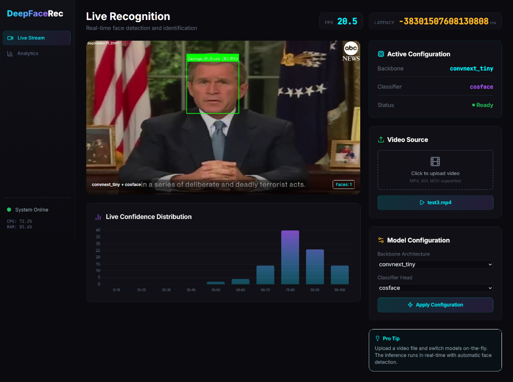
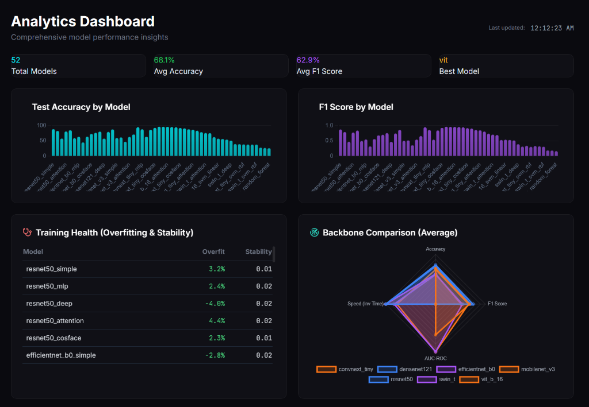
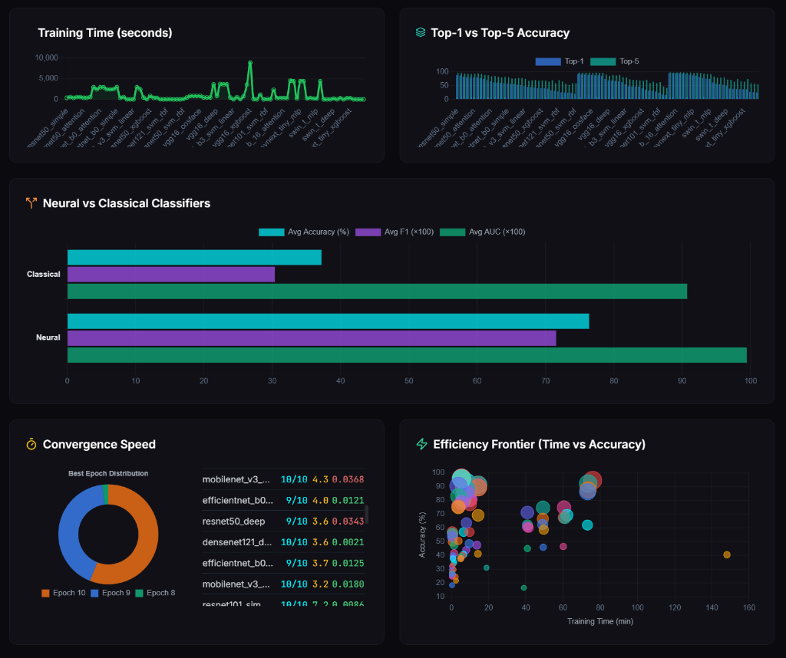
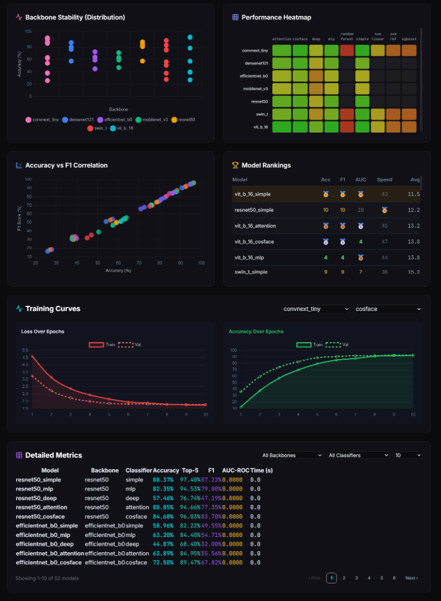

# 🤖 Deep Learning: Advanced Face Recognition System


## 📝 Project Context
This project was developed as part of the Deep Learning module. It represents a comprehensive exploration of face recognition architectures, focusing on the trade-offs between various backbones and classifier heads. We utilized the Labelled Faces in the Wild (LFW) dataset for training and evaluation.

## 🚀 Project Overview
We conducted an extensive benchmarking study, training and evaluating 90 different models. This was achieved by combining multiple state-of-the-art backbones with various classical and neural classifier heads.

- **Scale**: 90 unique model combinations.
- **Effort**: Spanning 3 detailed notebooks covering different architecture families.
- **Training Time**: Approximately 30 hours of total compute time.
- **Backbone Architectures**: VGG16, ResNet50/101, EfficientNetB0/B3, DenseNet121, MobileNetV3, ConvNeXt Tiny, Vision Transformer (ViT-S/B), Swin Transformer.
- **Classifier Heads**: Simple Linear, MLP (Deep Neural), SVM (Linear/RBF), Random Forest, XGBoost, Attention-based heads.

## 📁 Project Assets
- **Presentation**: Facial Recognition Presentation (.pptx)

## 📸 App Showcase

### 🔍 Live Inference & Real-time Analysis
The inference engine features real-time face detection (via MTCNN for training / OpenCV for live inference) and classification with live FPS and latency monitoring.


### 📊 Comprehensive Analysis Dashboard
The integrated dashboard provides deep-dive analytics for all 90 models, allowing for side-by-side comparison of performance metrics and training health.

**Analysis Overview**


**Model Rankings & Efficiency Frontier**


**Training Curves & Detailed Metrics**


## ✨ Key Features
- **Real-time Inference**: Process live video or uploaded files with on-the-fly model switching.
- **Extensive Benchmarking**: Compare 90 models across Accuracy, Top-5 Accuracy, F1-Score, AUC-ROC, and Inference Speed.
- **Multi-Backbone Support**: Support for CNN-based and Transformer-based architectures.
- **Deep Analytics**: Visualization of training curves, convergence speed, backbone stability, and model rankings.
- **Modern UI**: A premium, dark-mode interface built with glassmorphism and real-time Chart.js integration.

## 👥 Authors
- ZOUITNI Salah Eddine
- CHERGUI Yassir

## 🛠️ How to Run

### 1. Prerequisites
Ensure you have Python 3.8+ installed.

### 2. Install Dependencies
```bash
pip install -r requirements.txt
```

### 3. Launch the Application
```bash
python app/app.py
```
Then open your browser and navigate to:

- **Main App**: `http://localhost:5000`
- **Analytics**: `http://localhost:5000/dashboard`

*Developed for the Deep Learning Module - 2026*
